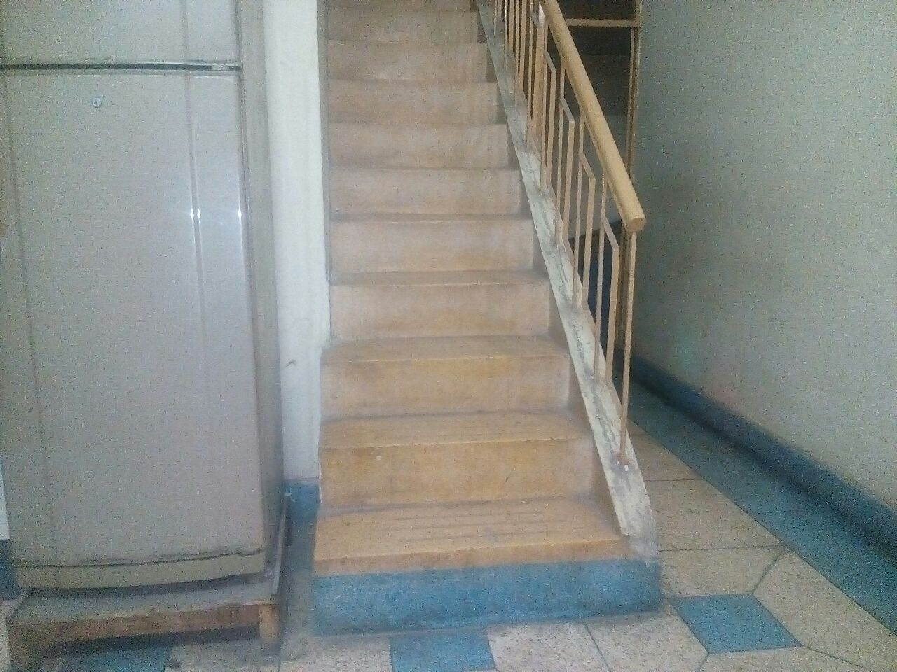

# Kitchen utensils detection
This jupyter notebook shows how to preprocess, augment and classify kitchen utensils (bowl,plate) images using inception model

## Dataset
Images of these utensils are manually collected and placed under 2 categories i.e. bowl and plate. A third class known as negative contain images of no-interest that do not include any utensil. A few sample images are shown below:

Bowl

Plate

Negative

## Preprocessing 
Following preprocessing techniques are used before training and inference on the test data:
1. Images are resized into fix shape
2. Gaussian filter is applied on resized image to the point where our object is still visible through naked eye

## Model training
Pre-trained Inception Network is used to extract features from video frames. A fully-connected layer based on number of classes i.e. 3 is used at the end and network is trained on augmented data
